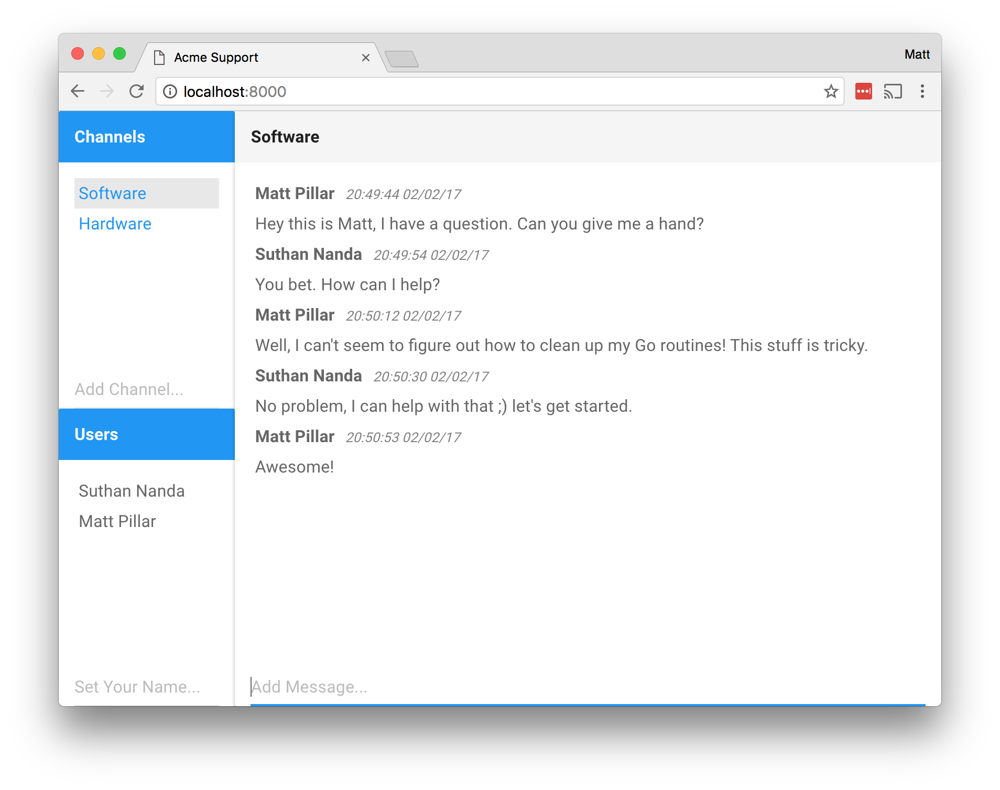

# Simple realtime chat

This project was created as part of an
<a href="https://www.udemy.com/realtime-apps-with-reactjs-golang-rethinkdb">online course</a>.
I wrote some notes on the course; they are located in
<a href="https://github.com/mpillar/learning/blob/master/engineering/courses/developing-realtime-web-applications.md">this repository</a>.

## Running the application

### Frontend

    cd js && npm install && npm start

### Backend

#### Configure database

Install RethinkDB.

#### Run Go code

    cd go && make install && make start

## Screenshot

## TODO

There are many backend pieces missing. The channel set and subscribe funcationality was added as a
PoC for the backend, but there is still much to do.
